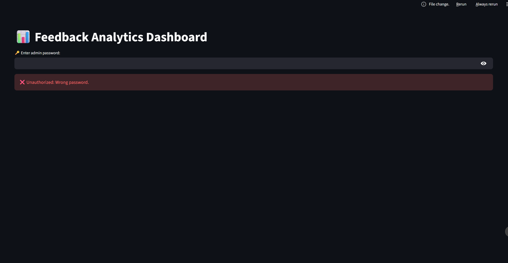
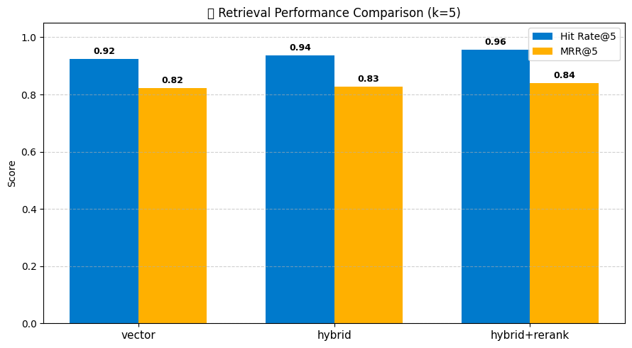
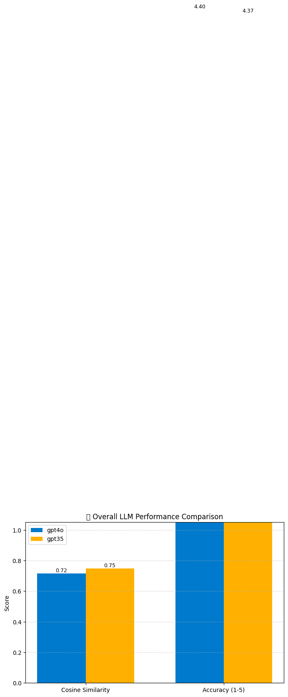

# 📚 Customer Support RAG System

[]()
[]()
[]()
[]()
[]()
[]()

---

## 🧠 Problem Description

Modern customer support teams are overwhelmed with repetitive FAQ queries, scattered documentation, and inconsistent responses. This project solves that by building a **Retrieval-Augmented Generation (RAG) system** that:

- Stores customer support FAQs in a semantic vector database.
- Retrieves accurate, relevant answers based on user queries.
- Generates improved answers using an LLM.
- Collects feedback and evaluates retrieval and generation quality.


---

## 📊 Dataset

- **Source:** [MakTek Customer Support FAQs](https://huggingface.co/datasets/MakTek/Customer_support_faqs_dataset)
- **Fields:** `question`, `answer`, `source`, `doc_id`

---

## 🔁 End-to-End Pipeline

```
Data Ingestion → Embedding → Qdrant Vector DB
                     ↓
            BM25 Keyword Index
                     ↓
      Hybrid Retrieval + Reranking
                     ↓
     LLM Generation → Feedback → Dashboard
```

---

## 📥 1. Data Ingestion

We load and clean the MakTek FAQ dataset, deduplicate questions, convert them into `Document` objects, and index them automatically into Qdrant.

📁 Code: [`data_ingestion.py`](./data_ingestion.py)

---

## 🧠 2. Embedding & Storage

- **Embedding model:** [`intfloat/multilingual-e5-base`](https://huggingface.co/intfloat/multilingual-e5-base)
- **Vector DB:** [Qdrant](https://qdrant.tech/)
- **Framework:** [LlamaIndex](https://github.com/run-llama/llama_index)

Documents are converted into dense vectors and stored with metadata for efficient retrieval.

📁 Code: [`data_ingestion.py`](./data_ingestion.py)

---

## 🔎 3. Retrieval Pipeline


| Stage | Method | Purpose |
|-------|--------|---------|
| 🔍 Vector Search | Dense retrieval via LlamaIndex + Qdrant | Semantic similarity |
| 📚 BM25 | Keyword retrieval | Text relevance |
| 🧠 Hybrid | Combines vector + BM25 | **[Best Practice ✅]** |
| 📊 Reranking | `cross-encoder/ms-marco-MiniLM-L-6-v2` | **[Best Practice ✅]** |

📁 Code: [`search_process.py`](./search_process.py)

---

## 🤖 4. LLM Integration

- **Models:** `gpt-4o-mini`, `gpt-3.5-turbo`
- Uses retrieved context to generate final answers
- Handles “no-answer” cases gracefully

📁 Code: [`search_process.py`](./search_process.py)

---

## 🖥️ 5. User Interface


- **User App:** Semantic search interface with optional LLM answers  
- **Admin Dashboard:** Feedback analytics + retrieval evaluation visualizations  
- **Password Protection:** Only authorized users can access the dashboard  

📁 Code: [`frontend/app.py`](./frontend/app.py), [`frontend/dashboard.py`](./frontend/dashboard.py)

🖼️ Screenshots:  
-   
- 

---

## 📈 6. Evaluation

### 📊 Retrieval Evaluation


We compare:

1. Dense Vector Search  
2. Hybrid Search  
3. Hybrid + Reranker  

Metrics: **Hit Rate@5**, **MRR@5**

📁 Code: [`search_evaluation.ipynb`](./notebook/search_evaluation.ipynb)  
🖼️ 

Based on a generated ground truth dataset of questions,i applied multi metrics to evalute the Dense Vector Search,Hybrid Search and Hybrid + Reranker.
Hybrid + Reranker demonstrated superior performance and was chosen as the preferred method.
---

### 🤖 LLM Evaluation


We evaluate `gpt-4o-mini` and `gpt-3.5-turbo` answers vs. ground truth using cosine similarity.

📁 Code: [`llm_evaluation.ipynb`](./notebook/llm_evaluation.ipynb)  
🖼️ 
🖼️ 

Relevance results were show as the gpt-3.5-turbo is better so we selected it as the default model.
---

## 📊 7. Monitoring & Feedback


- Collect user feedback (text + rating)
- Store it in PostgreSQL
- Analyze with charts: satisfaction trends, query volume, top queries, etc.

📁 Code: [`backend/feedback_service.py`](./backend/feedback_service.py)

---

## 🐳 8. Containerization


- Qdrant + PostgreSQL + RAG App in one command
- Reproducible and cloud-ready

📁 Code: [`Dockerfile`](./Dockerfile), [`docker-compose.yml`](./docker-compose.yml)

---

## 📁 Project Structure

```
customer-support-rag/
├─ backend/
│   ├─ rag_service.py
│   └─ feedback_service.py
├─ frontend/
│   ├─ app.py
│   └─ dashboard.py
├─ data_ingestion.py
├─ search_process.py
├─ notebook/
│   ├─ search_evaluation.py
│   └─ llm_evaluation.py
├─ main.py
├─ Dockerfile
├─ docker-compose.yml
└─ requirements.txt
```

---

## 🧪 How to Run

### 1️⃣ Clone the repo
```bash
git clone https://github.com/zainalabdeen/llm-zoomcamp/customer-support.git
cd customer-support
```

### 2️⃣ Set environment variables
Create a `.env` file:

```
OPENAI_API_KEY=sk-xxxxxx
ADMIN_PASSWORD=SuperSecret
```

### 3️⃣ Launch with Docker Compose
```bash
docker-compose up --build
```

✅ Access:  
- User App → http://localhost:8501  
- Admin Dashboard → http://localhost:8502

---

## 📜 License

MIT License © 2025 – Developed by **ZainAlabdeen**  
